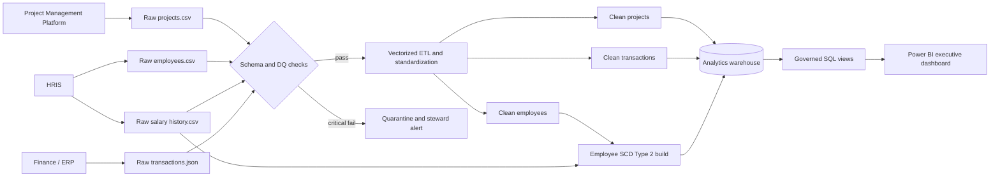

# Presight Data Governance Document

Owner: Data Governance Office  
Review cycle: Annual and after material schema or regulatory change  
Scope: Projects, employees, transactions, and employee salary history

## 1. Data inventory

| Dataset | Source system | Format | Update frequency | Volume estimate | Daily growth |
|---|---|---|---|---:|---:|
| projects | Project Management Platform | CSV extract | Daily | 500 rows | 1-5 rows |
| employees | HRIS | CSV extract | Daily | 1,000 rows | 0-5 rows |
| transactions | Finance/ERP | JSON extract | Daily | 50,000 rows | 100-500 rows |
| employees_salary_history | HRIS compensation module | CSV extract | On change plus daily export | 1,800 rows | 0-10 rows |

Volumes are planning estimates and must be replaced with monitored 30-day averages in production.

## 2. Data classification

Classifications are mutually exclusive at the catalog level. **Personal (PII)** takes precedence when a value identifies or can reasonably be linked to a person. PII in this scope is governed by UAE Federal Decree-Law No. 45 of 2021 (UAE PDPL); GDPR also applies when processing relates to individuals in its territorial scope.

### projects.csv

| Column | Classification | Rationale / regulation |
|---|---|---|
| project_id | Internal | Internal source identifier |
| project_name | Confidential | May reveal client initiatives or strategy |
| department | Internal | Organization metadata |
| status | Internal | Operational state |
| start_date | Internal | Delivery schedule |
| end_date | Internal | Delivery schedule |
| budget | Confidential | Non-public financial allocation |
| actual_cost | Confidential | Non-public financial performance |
| project_manager_id | Personal (PII) | Indirect employee identifier; UAE PDPL and GDPR when applicable |
| priority | Internal | Delivery metadata |
| region | Internal | Operating geography; not person-level in this dataset |

### employees.csv

| Column | Classification | Rationale / regulation |
|---|---|---|
| employee_id | Personal (PII) | Persistent employee identifier; UAE PDPL and GDPR when applicable |
| full_name | Personal (PII) | Direct identifier; UAE PDPL and GDPR when applicable |
| email | Personal (PII) | Direct contact identifier; UAE PDPL and GDPR when applicable |
| department | Personal (PII) | Employment attribute linked to an individual; UAE PDPL and GDPR when applicable |
| role | Personal (PII) | Employment attribute linked to an individual; UAE PDPL and GDPR when applicable |
| level | Personal (PII) | Career attribute linked to an individual; UAE PDPL and GDPR when applicable |
| hire_date | Personal (PII) | Employment history; UAE PDPL and GDPR when applicable |
| salary | Personal (PII) | Sensitive compensation linked to an individual; UAE PDPL and GDPR when applicable |
| manager_id | Personal (PII) | Identifies reporting relationships; UAE PDPL and GDPR when applicable |
| region | Personal (PII) | Employee location attribute; UAE PDPL and GDPR when applicable |
| status | Personal (PII) | Employment status; UAE PDPL and GDPR when applicable |
| years_experience | Personal (PII) | Professional history linked to an individual; UAE PDPL and GDPR when applicable |

### transactions.json

| Column | Classification | Rationale / regulation |
|---|---|---|
| transaction_id | Confidential | Finance-system identifier |
| project_id | Internal | Internal project reference |
| vendor_id | Confidential | Commercial counterparty identifier |
| vendor_name | Confidential | Supplier relationship information |
| category | Internal | Spend classification |
| amount | Confidential | Commercial amount |
| currency | Internal | Transaction metadata |
| transaction_date | Confidential | Commercial activity detail |
| approved_by | Personal (PII) | Employee identifier and approval activity; UAE PDPL and GDPR when applicable |
| payment_status | Confidential | Payables state |
| invoice_ref | Confidential | Financial document identifier |
| notes | Confidential | Free text may contain commercial or incidental personal data; apply DLP scanning |

### employees_salary_history.csv

| Column | Classification | Rationale / regulation |
|---|---|---|
| employee_id | Personal (PII) | Persistent employee identifier; UAE PDPL and GDPR when applicable |
| previous_salary | Personal (PII) | Historical compensation; UAE PDPL and GDPR when applicable |
| new_salary | Personal (PII) | Compensation; UAE PDPL and GDPR when applicable |
| previous_role | Personal (PII) | Employment history; UAE PDPL and GDPR when applicable |
| new_role | Personal (PII) | Employment history; UAE PDPL and GDPR when applicable |
| previous_level | Personal (PII) | Career history; UAE PDPL and GDPR when applicable |
| new_level | Personal (PII) | Career history; UAE PDPL and GDPR when applicable |
| effective_date | Personal (PII) | Dated employment event; UAE PDPL and GDPR when applicable |
| change_type | Personal (PII) | Promotion/compensation event; UAE PDPL and GDPR when applicable |
| change_reason | Personal (PII) | Performance or employment context; UAE PDPL and GDPR when applicable |

## 3. Data ownership

| Dataset | Data Owner (role) | Data Steward (role) | Access approver |
|---|---|---|---|
| projects | Chief Operating Officer | PMO Data Steward | PMO Director |
| employees | Chief Human Resources Officer | HR Data Steward | HR Director and Privacy Officer |
| transactions | Chief Financial Officer | Finance Data Steward | Financial Controller |
| employees_salary_history | Chief Human Resources Officer | Compensation & Benefits Data Steward | CHRO and Privacy Officer |

The **Owner** is accountable for lawful purpose, risk appetite, access policy, and business outcomes. The **Steward** performs day-to-day cataloging, quality monitoring, issue resolution, lineage maintenance, and policy implementation.

## 4. Retention policy

| Dataset | Retention | Justification | End-of-retention action | Enforced by |
|---|---|---|---|---|
| projects | Active life plus 7 years | Contract audit, delivery disputes, financial reconciliation | Archive immutable records, then delete or anonymize client-identifying fields | PMO with Records Management |
| employees | Employment plus 5 years | HR operations, claims, privacy minimization | Secure delete; retain only anonymized workforce statistics | HR with Privacy Office |
| transactions | 7 years after fiscal close | Audit, accounting, contractual and tax evidence | Encrypted archive followed by verified deletion | Finance with Records Management |
| employees_salary_history | Employment plus 7 years, subject to Legal confirmation | Labour claims, payroll audit, end-of-service calculations, and tax/accounting evidence require a longer window than ordinary HR profiles | Restricted encrypted archive, then secure deletion or irreversible anonymization | HR, Legal, and Records Management |

Retention clocks are suspended by legal hold. The stated periods are governance baselines, not legal advice; Legal must validate them against the current UAE Labour Relations Law, tax rules, free-zone requirements, contract terms, and any applicable GDPR limitation periods before production adoption.

## 5. Access control

| Persona | Projects | Employees | Transactions | Salary History |
|---|---|---|---|---|
| Data Engineer | Read + Write | Read + Write | Read + Write | Read (approved support only) |
| BI Analyst | Read | Read (masked analytical view) | Read | None |
| Finance Team | Read | Read (name/department only) | Read + Write | None |
| HR Team | Read | Read + Write | None | Read + Write |
| Executive | Read | Read (aggregated view) | Read (aggregated view) | None |

No routine persona receives delete rights. Deletion uses a separately approved service role with dual authorization and audit logging. Salary history is denied by default because compensation history is not required for BI, Finance, or executive duties; HR access is role-scoped, time-bound where feasible, protected with MFA, and reviewed quarterly. Production access uses named identities, least privilege, encryption in transit/at rest, column masking, and immutable access logs.

## 6. Data lineage

Quality checks occur at ingestion and before warehouse load. Transformation code records row counts and decisions; the warehouse preserves source natural keys and uses surrogate keys for historized joins. Reports consume governed views rather than unrestricted raw tables.
